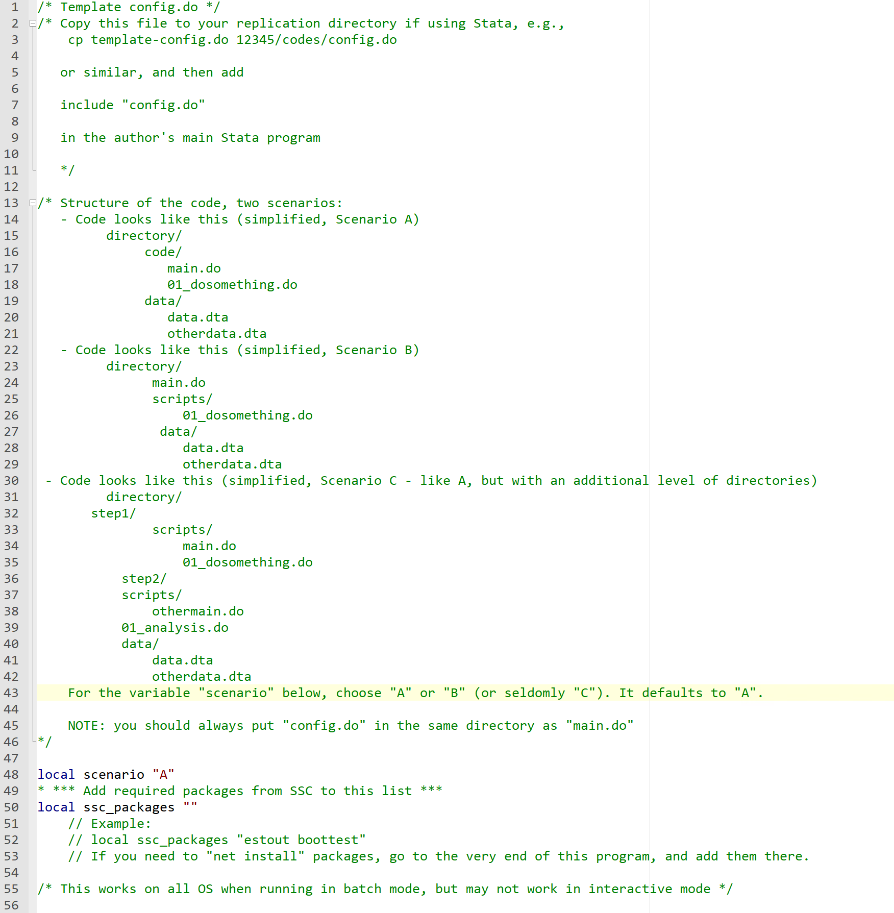
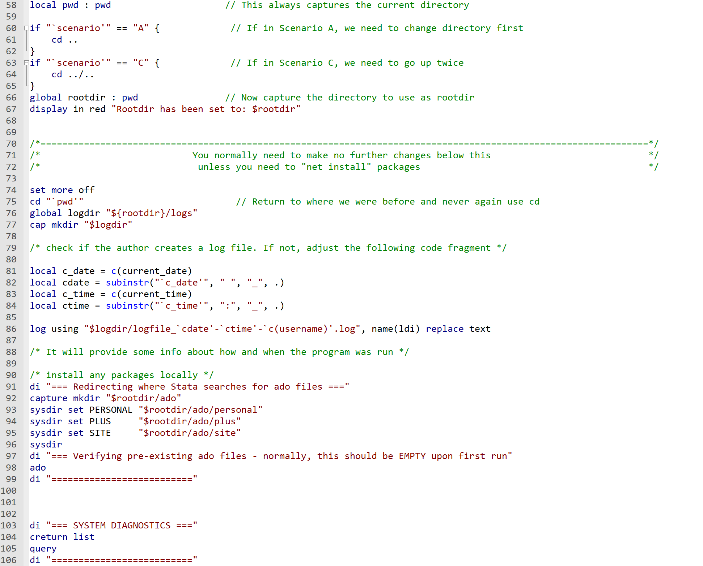
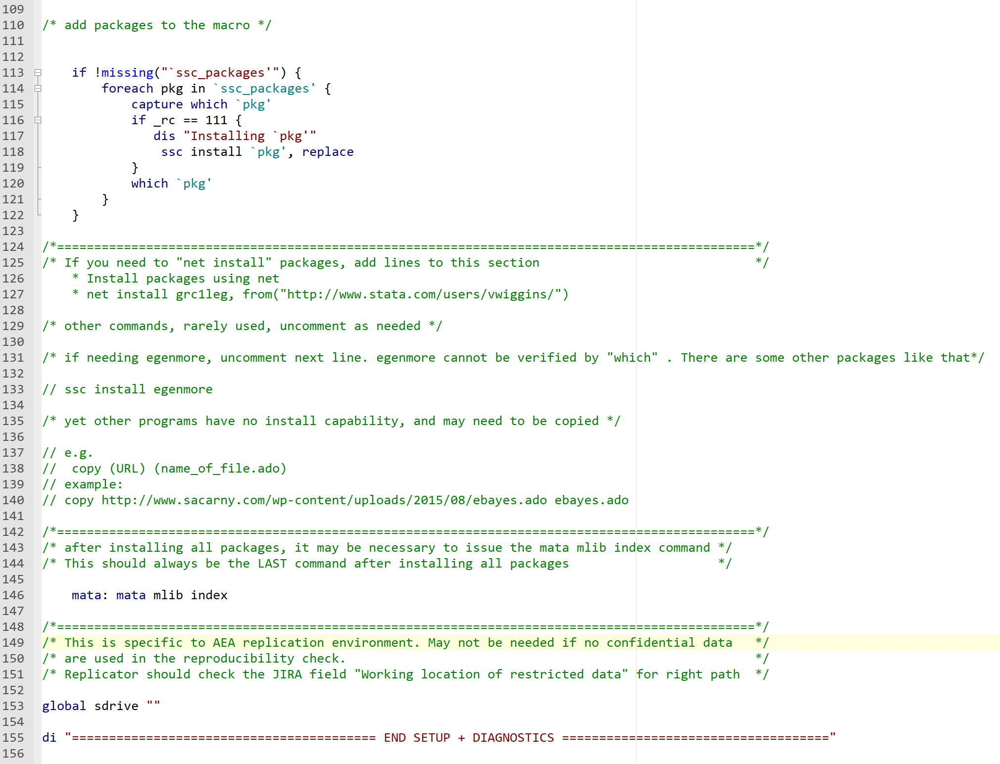
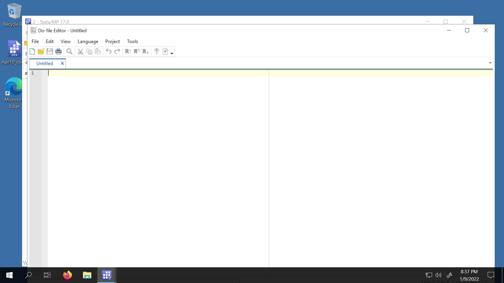
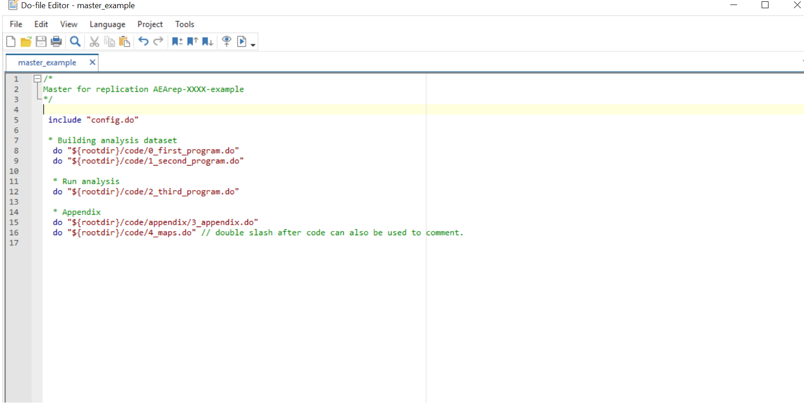
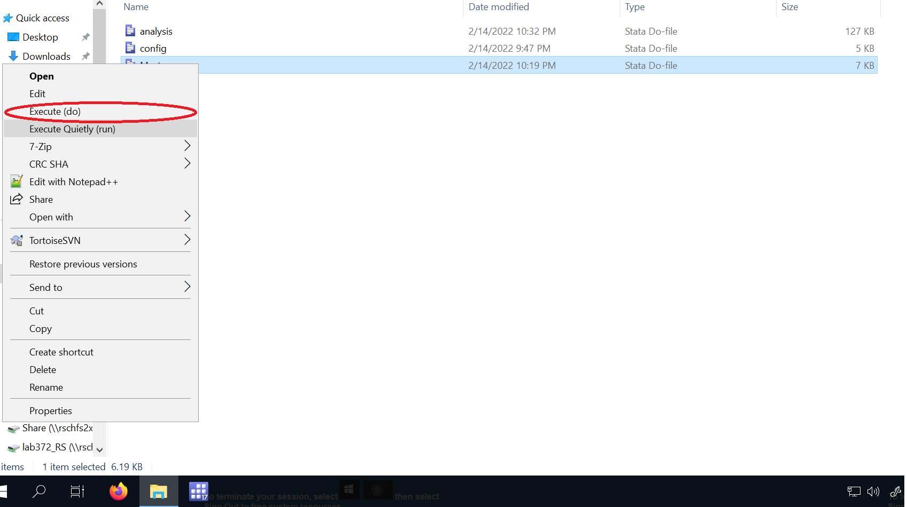

# How to Run Stata Code

##

These slides are based on the [Stata-related procedures](https://labordynamicsinstitute.github.io/ldilab-manual/96-00-using-Stata.html) section of the training manual.

## config.do






## Purpose

- Generate log files.
- Install programs.

## Set up

- Rename template-config.do and place it in the same directory as the .do file(s) you will run.
- Add lines to the file(s) so that they execute config.do when run. To clarify:
  - If there is no master.do file, add `include config.do` at the beginning and `log close _all` at the end of the .do file(s) you will run.
  - If there is a master.do file, add the lines to it, only.


### Walkthrough

#### Package Installation

- Indicates the structure of the code.
- Installs Stata packages needed for replication.
- You will need to add package names to line 50. (Use line 52 as an example).

#### Present/Working Directory Set Up

- Sets file path to root directory (based on the structure indicated previously).
- Creates a sub-directory to save logs in, if necessary.
- Keep this area even if authors' code also produces log files.

#### Diagnostics

- Provides information about the system the code is run on, for the replication package.

#### Other

- Includes lines for specific cases, e.g.
  - Net installation of packages
  - mata
  - S drive path set up

## master.do

If the authors do not provide a master .do, but the order in which each program is run is clear (either from file names or from the README), then create a master.do as follows:


##



##

- Add `include config.do` for the first line and `log close _all` for the last line.
- For each program that needs to be run, write `do` and the path. Make sure these lines are in the right sequence.

```
include "config.do"
 
* Assuming scenario "A"

do "${rootdir}/code/0_first_program.do" 
do "${rootdir}/code/1_second_program.do"
do "${rootdir}/code/2_third_program.do"
do "${rootdir}/code/appendix_code/appendix.do"

log close _all

```

##



##


## General Stata Tips


## Modifying File Paths

- Typically will require one modification to either the master .do file or to a program called by the master .do file. 

Before:

```
*/ This is Master do file /*

global maindir "C:\Users\Author\Dropbox\Project1" // this is the path to the repository
global data "$maindir/data" // path to data folder
global figures "$maindir/figures" // path to figures folder
```

After:

```
include "config.do"

*/ This is Master do file /*

global maindir "$rootdir" // this is the path to the repository
global data "$maindir/data" // path to data folder
global figures "$maindir/figures" // path to figures folder
```

##

- Certain errors may indicate that a subdirectory is missing. If the programs/README/other documentation verify this, then you should create the missing directories.

E.g.

```
log using "${path}\Output\maindata.log", replace
(file U:\AEAworkspace\aearep-3835\182763\Output\maindata.log not found)
file U:\AEAworkspace\aearep-3835\182763\Output\maindata.log could not be opened
r(603)
```

##

- Also note that the config .do file has a parameter called `scenario` that is set to `A` by default.
  - `A` indicates the case where the master .do file is in a subfolder of the root directory.
  - `B` indicates the case where the master .do file is in the root directory. Change the default if needed.

Scenario A

```
 directory/
              code/
                 main.do
                 01_dosomething.do
              data/
                 data.dta
                 otherdata.dta

```

Scenario B

```
 directory/
        main.do
        scripts/
             01_dosomething.do
        data/
             data.dta
             otherdata.dta
```

## Running the Code

- Right click on the master .do file and select the option `Execute (do)`. This will set the working directory location to the location where the master .do file is, automatically.




##

- To run Stata on Git Bash from CISER, use the following command (note that relative paths can also be used):

```
"C:/Program Files/Stata17/StataMP-64.exe" -b do "U:/test/master.do"
```

- To run Stata on Powershell on Windows (e.g. personal laptop), use the following command:

```
'C:\Program Files\Stata16\StataMP-64.exe' /b do .\master.do
```

- To run Stata on Linux/MacOS, use the following command:

```
stata-mp -b do master.do
```

- Note that relative file paths to the .do file can also be used.


## Missing Package(s)

- Typically indicated in error messages, e.g. ``command not found`` or ``type ssc install``, and can be resolved through modifications to config.do.
- Note that the potentially missing packages flagged by `scan_packages.do` may be generating some of these errors.
  - As a reminder, don't add those flagged packages to `config.do` before running code for the first time. (An exception would be if the README indicates long runtimes.)
